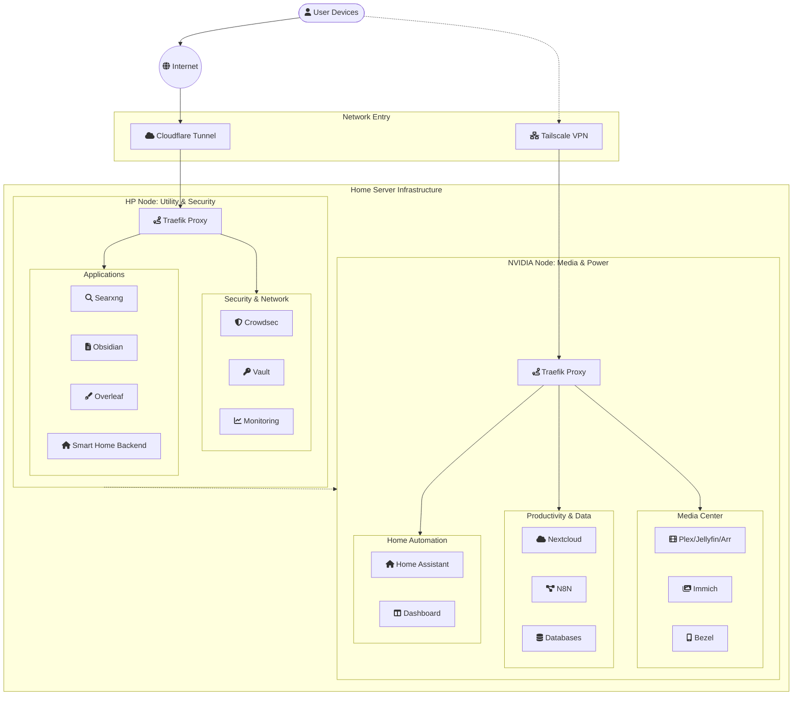

# Home Server

This repository contains the configuration and setup for my home lab infrastructure. It relies heavily on Docker Compose to manage various services across different machines.

## Repository Structure

The repository is organized into two main directories:

- **`compose/`**: Contains Docker Compose configuration files, organized by machine.
- **`tools/`**: Contains utility shell scripts for system management and setup.

## Architecture Diagram



## Services (Compose)

The `compose` directory is split into subdirectories representing different servers in the home lab.

### `hp` (Utility & Security Node)

Focuses on network security, cloud tunnels, and lightweight utilities.

- **cloudflare**: Cloudflare Tunnel configuration.
- **crowdsec**: Security automation and intrusion detection.
- **monitoring**: System monitoring stack.
- **obsidian-sync**: Self-hosted Obsidian synchronization.
- **overleaf**: Self-hosted LaTeX editor.
- **searxng**: Private search engine.
- **smart-home**: IoT related services.
- **traefik**: Reverse proxy and load balancer.
- **vault**: hashicorp vault / password management.

### `nvidia` (Media & Application Node)

A more powerful node (presumably with GPU acceleration) running media servers, home automation, and heavier applications.

- **home assistant**: Home automation core.
- **smart-media**: Stack for media management (Plex, Jellyfin, Arr stack, etc.).
- **immich**: Self-hosted photo and video management.
- **nextcloud**: Productivity suite and file storage.
- **n8n**: Workflow automation.
- **openUI**: UI related services.
- **tailscale-vpn**: VPN mesh networking.
- **traefik**: Reverse proxy for this node.
- **monitoring**: System monitoring for this node.
- **db**: Database services.
- **dashboard**: Main dashboard for services (e.g., Homepage or Dashy).
- **bezel**, **scrobble**, **share**, **photo**, **onedrive**: Various other utility containers.

## Infrastructure Tools

The `tools/` directory contains Bash scripts to help with server provisioning and maintenance.

- **`alias.sh`**: Adds useful aliases to `.zshrc` (e.g., shortcuts for navigating to compose directories).
- **`docker.sh`**: Installs Docker Engine and Docker Compose (useful for setting up a new machine).
- **`disk_creator.sh` / `disk_creator_gpt.sh`**: Scripts for partitioning and formatting disks.
- **`mount_disk.sh`**: Helper to mount external drives.
- **`nvidia.sh`**: Script likely used for setting up NVIDIA drivers or container toolkit.
- **`check.sh`**: Simple system check or status script.

## Getting Started

1. **Clone the repository**:

   ```bash
   git clone https://github.com/pratikngupta/home-server.git
   cd home-server
   ```

2. **Navigate to a service**:

   ```bash
   cd compose/nvidia/smart-media
   ```

3. **Deploy a stack**:

   ```bash
   docker compose up -d
   ```

4. **Use Tools**:
   Run scripts from the `tools` directory to setup environments:
   ```bash
   sudo ./tools/docker.sh
   ```
